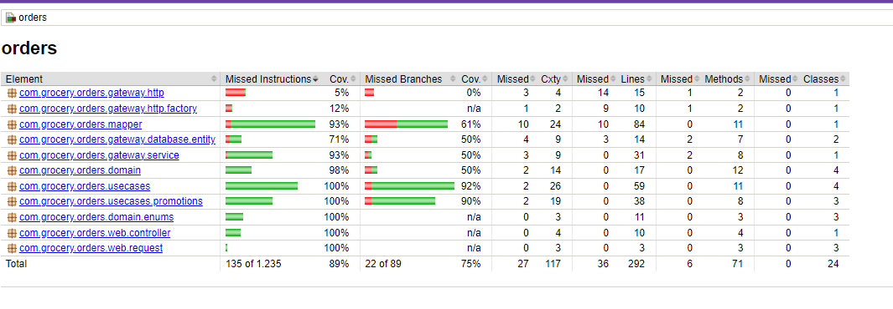
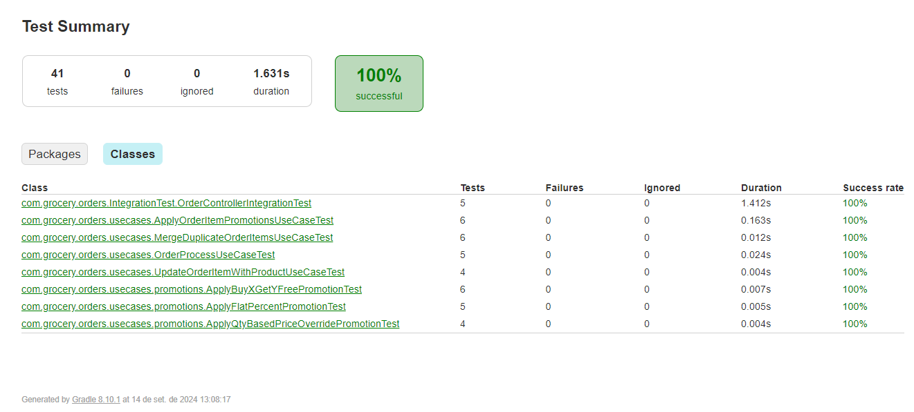
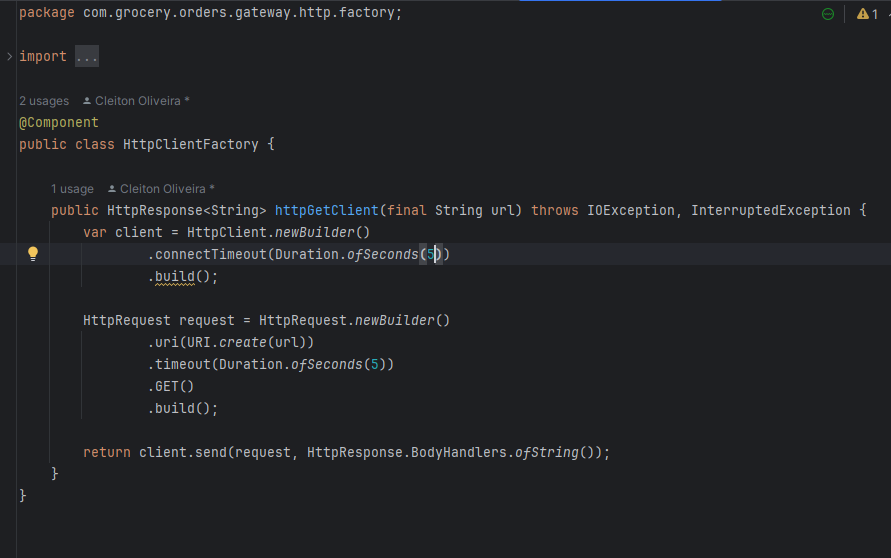

# Grocery Store Order Payment System - API

## Project Overview
This project is a Java API that interacts with a Wiremock server to retrieve item data and apply promotions for a grocery store payment system.

The API simulate the backend of a system that processes customer purchases, applies applicable promotions, and calculates savings dynamically. The API is designed to handle future integrations, making it extendable for additional data sources and promotion types.

## Key Features
- **Item Addition**: Items can be added in any order, and the total amount will be updated.
- **Promotions**: Automatically applies promotions based on items in the cart and displays customer savings.
- **Wiremock Integration**: Consumes a predefined Wiremock API to fetch product data.
- **Scalability**: Easily extendable for future data sources and new promotion types.

## Tech Stack
- **Java**: 21
- **Spring Boot**: v3.2.9 - For building the API and handling HTTP requests.
- **Gradle**: For dependency management and building the project.
- **Lombok**: Boilerplate code with easy-to-use annotations. It makes code easier to read
- **JUnit & Mockito**: For unit testing and mocking dependencies.
- **Jacoco**: Used to check code for test code coverage and creates reports.
- **Wiremock**: Simulated the external product API.
- **Database**: PostgreSQL

## How to build and Run
1. **Clone the Repository**:
   ```bash
   git clone https://github.com/zherro/grocery-orders
   cd grocery-orders
   ```

2. **Build the Project**:  

   This project use Gradle:
   ```bash
   ./gradlew build
   ```

3. **Run the Application**:  
   Start the Spring Boot application with:
   ```bash
   ./gradlew bootRun
   ```

4. **Access the API**:  
   The API will be available at `http://localhost:8080`.


## How to Run with Docker
   Running service with docker. (this provided a complete setup for test/validation purpose )

   ```bash
   git clone https://github.com/zherro/grocery-orders
   
   cd grocery-orders
   
   docker compose up -d
   ```

   - **Open API Doc (Swagger)**: http://localhost:18080/swagger-ui/index.html
   - **Wiremock Products**: http://localhost:18081/:paths


## API Endpoints

### Create an Order
- **Endpoint**: `POST /api/orders`
- **Request Body**:

```json
{
  "customer_id": "string",
  "customer_name": "string",
  "products": [
    {
      "product_id": "PWWe3w1SDU",
      "qty": 2
    },
    {
      "product_id": "PWWe3w1SDU",
      "qty": 2
    }
  ]
}
```

- **Response**:
 
 ```json
{
  "id": "e74cecb2-de0a-44e3-980f-c1b43384797b",
  "customer_id": "string",
  "customer_name": "string",
  "status": "OPEN",
  "order_total_discount": 999,
  "order_total_price": 3996,
  "products": [
    {
      "id": "629de8dc-9426-405c-aeb8-c1c6184f7e22",
      "product_id": "PWWe3w1SDU",
      "product_name": "Amazing Burger!",
      "price": 999,
      "qty": 5,
      "discount_price": 999,
      "applied_promotions": [
        {
          "promotion_type": "BUY_X_GET_Y_FREE",
          "total_discount": 999,
          "enabled": true
        }
      ],
      "total_price": 3996,
      "product_status": "OK"
    }
  ]
}
  ```

### Get Order by ID
- **Endpoint**: `GET /api/orders/{id}`
- **Response**:

```json
 {
  "id": "e74cecb2-de0a-44e3-980f-c1b43384797b",
  "customer_id": "string",
  "customer_name": "string",
  "status": "OPEN",
  "order_total_discount": 999,
  "order_total_price": 3996,
  "products": [
    {
      "id": "629de8dc-9426-405c-aeb8-c1c6184f7e22",
      "product_id": "PWWe3w1SDU",
      "product_name": "Amazing Burger!",
      "price": 999,
      "qty": 5,
      "discount_price": 999,
      "applied_promotions": [
        {
          "promotion_type": "BUY_X_GET_Y_FREE",
          "total_discount": 999,
          "enabled": true
        }
      ],
      "total_price": 3996,
      "product_status": "OK"
    }
  ]
}
```

### Update Order
- **Endpoint**: `PUT /api/orders/{id}`
- **Request Body**:

```json
{
  "products": [
    {
      "product_id": "PWWe3w1SDU",
      "qty": 2
    }
  ]
}
```

- **Response**:

```json
 {
  "id": "e74cecb2-de0a-44e3-980f-c1b43384797b",
  "customer_id": "string",
  "customer_name": "string",
  "status": "OPEN",
  "order_total_discount": 999,
  "order_total_price": 3996,
  "products": [
    {
      "id": "629de8dc-9426-405c-aeb8-c1c6184f7e22",
      "product_id": "PWWe3w1SDU",
      "product_name": "Amazing Burger!",
      "price": 999,
      "qty": 5,
      "discount_price": 999,
      "applied_promotions": [
        {
          "promotion_type": "BUY_X_GET_Y_FREE",
          "total_discount": 999,
          "enabled": true
        }
      ],
      "total_price": 3996,
      "product_status": "OK"
    }
  ]
}
```

## Get All orders

- **Endpoint**: `GET /api/orders`

Provide search for all orders by customer.

## How Promotions Work
- **BUY_X_GET_Y_FREE**: If a customer buys X items or more, they get Y items free.
- **QTY_BASED_PRICE_OVERRIDE**: If a customer buys a minimum quantity of items, a fixed price is applied for promotion item quantity.
- **FLAT_PERCENT**: all itens has percent discount apllied

## Project Structure
```
src
├── main
│   ├── java
│   │   └── com.grocery.orders
│   │       ├── config         // Global config: Open API, Config Beans...
│   │       ├── domain         // Domain entities (Order, Product, Promotion)
│   │       ├── gateway        // Integration with externa resources
│   │       │    ├── database  // Database mapped entities and repositories
│   │       │    ├── http      // Externa rest api integration ( wiremock porducts service)
│   │       │    └── service   // Layer that provides a simple interface and encapsule gateway components
│   │       ├── mapper         // POJO mappers
│   │       ├── usecases       // Business logic and promotion handling
│   │       └── web
│   │           └── controller // Handles HTTP requests
├── test                       // Unit and Integration tests
└── resources                  // Application config
```

## Testing
Run the tests using:

```bash
./gradlew test
```

Generate Jacoco reports:

````bash
./gradlew test jacocoTestReport
````

Check test coverage:
````bash
./gradlew test jacocoTestCoverageVerification
````

### Test Coverage Reports

The project is setup to min of 80% of coverage.
> NOTE: the use cases coverage is 100%




## Follow-up Questions

1. **How long did you spend on the test? What would you add if you had more time?**  
   **12-09-2024**
   1. 01:30 hour: create project, analise tasks, and wiremock product service, and create main domain POJOs.
   
   **13-09-2024**
   1. 01:30 hour: make create order service, create first Integration Test
   2. 03:00 hours: make get order service, integrate wiremock product service, create first promotion use case **with unit test**.
   3. 02:00 hours: make update order service, and validate services consistence
   
   **14-09-2024**
   1. 02:00 hours: create other two use cases promotions and unit test with 100% coverage. Create others necessary use cases ande validate business logic, with unit tests too.
   2. <a href="https://github.com/zherro/grocery-orders/commit/be45efc91172d6f691ffaf32d58c96633d61bcdf" target="_blank">03:00 hours</a>: create integration test for all services and code review.
   3. 02:00 hours: documentation (I have dedicated a good time to make a rich documentation (readme), to simplify de project understand)

2. **What was the most useful feature that was added to the latest version of your chosen language? Please include a snippet of code that shows how you've used it.**  
   I used some updates of last Java JDK versions:
   - var declaration by type inference
   - new switch-case
   - HttpClient library

   May be, we can use virtual treads of java 21 to process requests from detail products, when needed retrieve product promotions information. But, this information could be served with product too, this is another way to reduce the number of product details requests.

   

3. **What did you find most difficult?**  
   I didn't have the biggest difficulty with this test, I liked to do this.

   All libraries and designs used in this project, are solutions that I experienced at some moment.

   I only think, if I have understood promotions domains with the correct rules. So, I applied the solution that make more sense based on main delivery apps promotions rules,
   observing the promotion domain name from wiremock.

4. **What mechanism did you put in place to track down issues in production on this code? If you didn’t put anything, write down what you could do.**  
   This project is prepared to deploy with docker.
   
   In production, we can use Kubernates to manage scalability and infrastructure resources (memory, cpu).

   For metrics has many ways todo this, using plugins or log tracing.

5. **The Wiremock represents one source of information. We should be prepared to integrate with more sources. List the steps that we would need to take to add more sources of items with different formats and promotions.**  
   To add more types of promotions, you need change only two points:
   1.  First create an UseCase for new promotion in <a href="https://github.com/zherro/grocery-orders/tree/master/src/main/java/com/grocery/orders/usecases/promotions"  target="_blank">usecases/promotions package</a>.
   2.  Finally, map the promotion type in <a href="https://github.com/zherro/grocery-orders/blob/master/src/main/java/com/grocery/orders/usecases/ApplyOrderItemPromotionsUseCase.java"  target="_blank">ApplyOrderItemPromotionsUseCase.java</a>.

In this way,  new promotion rules will be automatically applied.

## If you got here

Thanks for your time, regards!